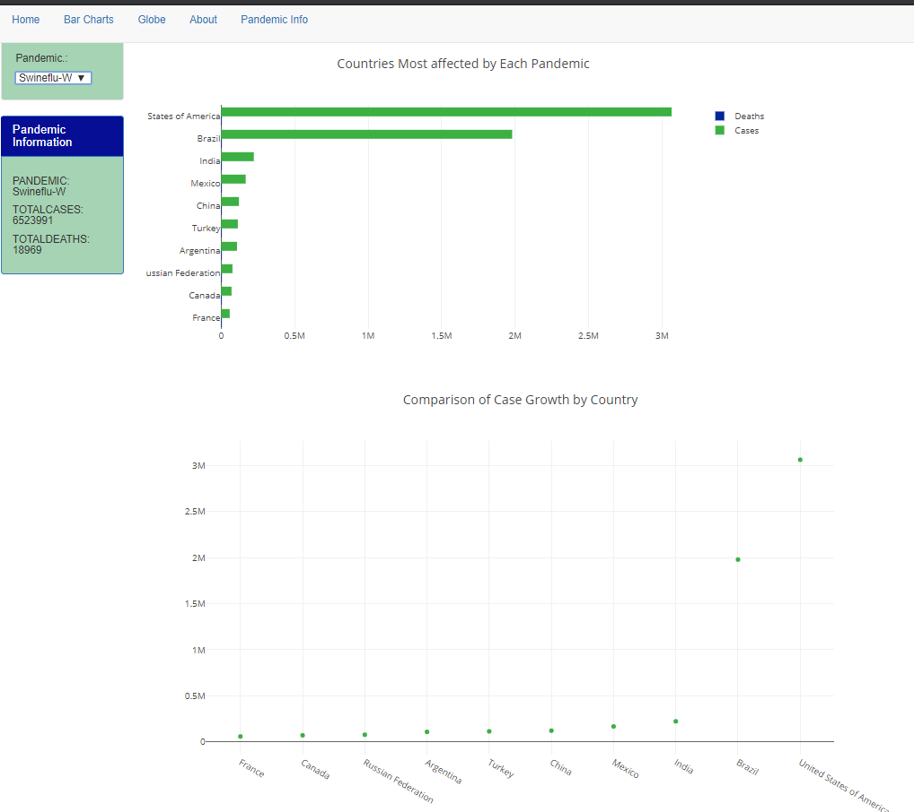

# Project 2:  Pandemics
## By Melissa Wright and Molly Cox
### [With additional technical support from tutors Mark Steadman, Samael Reyna, and Earnest Long Jr.]
## The Task
1. Use a Python Flask–powered RESTful API, HTML/CSS, JavaScript, and one database:  SQLite. 
2. Make a dashboard page with multiple charts that update from the same data : Globe, Bar, Line  
3. Use a JS library that we did not cover in class:  PlanetaryJS
4. Ensure Visualizations are powered by  data sets with at least 100 records. : Multiple Pandemics & Centroids for plotting 195 Countries 
5. User-driven interaction: dropdowns & Menu Bar to view about page / pandemic info / charts 
6. Final visualization should ideally include at least three views. : Globe, Bar Chart, and Line Chart


### Dataset
1. Covid19:   https://www.kaggle.com/sudalairajkumar/novel-corona-virus-2019-dataset#covid_19_data.csv
2. Ebola 2014-16:  https://www.kaggle.com/imdevskp/ebola-outbreak-20142016-complete-dataset (we added possible, suspected to the confirmed deaths)
3. Swineflu 2009:  https://en.wikipedia.org/wiki/2009_flu_pandemic_by_country
4. Spanish Flu:  https://ourworldindata.org/spanish-flu-largest-influenza-pandemic-in-history  (for reference, not included in visualizations) 

### Dataset for Population & Plotting on Map 

1. United Nations:  https://population.un.org/wpp/Download/Standard/Population/
2. Centroids Data - https://worldmap.harvard.edu/data/geonode:country_centroids_az8 

### ETL PROCESS 

We used Jupyter Notebook to accomplish the following:
* Take the raw data and group by Country/Year. 
* Merge the dataset with United Nations populations data so we could compare the magnitude of the epidemic relative to country population.
* Merge this dataset with a dataset that contains a latitude and longitude for the center of each country so that we could plot the data on the globe.  
* To merge the files by country, we made a lookup table that had the country names for each data set.  
* Create a Jupyter Notebook for each Pandemic and then had it generate a clean CSV file. 
* Import the now clean csv files into a new notebook, combine them, and store the data in a sqlite database.

Jupyter Notebook Files:
* lastdate_covid_19_scrubbing
* ebola_scrub
* swineflu_scrub_wikipedia
* pop_scrub
* combine_csvs

Scrubbed .CSV Files:
* merged_covid_19_data
* swineflu_data
* ebola_data

* pop_data
* clean_country_centroids_az8 (centroid data)
* Country_lookup_table

Database File:
* pandemic_final.db (sqlite database)


#### PANDEMIC WEBSITE - VISUALIZATIONS
#### MENU BAR TO ACCESS BAR CHARTS  
These Change as you select the drop down 



These Change as you select the drop down 
#### MENU BAR TO ACCESS GLOBE 
** There is a delay when running these so we have taken a screenshot of the corresponding globe image

 
 
 

 ``````

 ### Challenges
 * Accuracy and availability of data: there is a lack of comprehensive data for pandemics prior to 1960 
 * Making the Flask/Database/Javascript connection:  Until we were able to do it ourselves, we didn't understand how to put all these pieces together.

 ### If we had more time...
 * Try to fix delay in epidemic data appearing on globe
 * Add more pandemics to list of visualizations for comparison
 * Clean up jupyter notebooks to be more efficient
